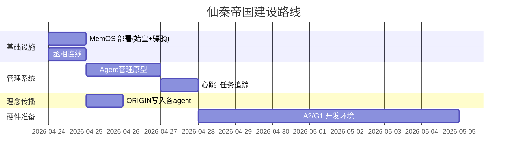

# 仙秦帝国 · 任务进度表

> 协调者维护，实时更新。每个任务分配后，下属先调研分解返回时间表，协调者据此跟踪。

## 当前任务

| ID | 任务 | 分配 | 状态 | 预估 | 截止 | 关键节点 |
|----|------|------|------|------|------|----------|
| T001 | MemOS + Wiki 部署 | 始皇帝 | ⏳待分配 | — | — | MemOS 运行 + Wiki 同步 |
| T002 | MemOS + Wiki 部署 | 骠骑将军 | ⏳待分配 | — | — | MemOS 运行 + Wiki 同步 |
| T003 | 丞相连线 + 部署 | 丞相 | ⏳等SSH | 5min | 今晚 | SSH 通 + Hermes API 通 |
| T004 | Agent 管理系统原型 | 协调者 | 🔄调研完成 | 2-3天 | 2026-04-27 | 心跳+任务追踪+Mermaid |
| T005 | 仙秦理念写入各agent | 全体 | ⏳待T001/T002 | — | — | 每个 agent 读到 ORIGIN |
| T006 | A2 和 G1 开发环境准备 | 骠骑将军 | ⏳等待硬件 | — | 硬件到货后 | Isaac Sim + ROS2 + SDK |

## 任务状态

- ⏳待分配 — 等待协调者发送
- 🔄进行中 — 下属在执行
- ⚠️阻塞 — 需要外部输入/资源
- ✅完成 — 已验证交付
- ❌失败 — 需要重试或调整

## 心跳记录

| 时间 | 始皇帝 (100.64.63.98:8642) | 骠骑 (100.67.214.106:8642) | 丞相 (100.76.65.47:8642) |
|------|---------------------------|---------------------------|------------------------|
| 2026-04-24 19:30 | 🟢 API 通 | 🟢 API 通 | 🔴 SSH 未开 |

## 关键路径

## 原则

1. 协调者不执行具体操作，只分配和追踪
2. 下属接到任务后必须返回：分解方案 + 时间表
3. 时间到未反馈 → 协调者主动问询
4. 并行任务用并行，串行任务用串行
5. 每次交互后更新此表
